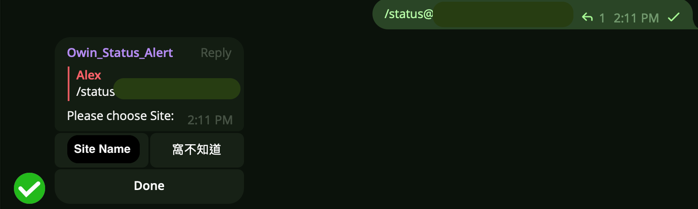

# website_alerts

## Design concept
* In order to be able to instantly check the online user count and domain request frequency within 1-24 hours on Telegram (TG).

## Tools and Techniques Required
* User Count Exporter (Scrape Data Using Crawlers)
* Elastic 

## instructions
```=Bash
/status
```


### After Pressing Site Name


#### <span style=color:green>rank5 or rank10</span>


#### After choosing time range


#### <span style=color:blue>usercount</span>
Show Online Real-Time UserCount